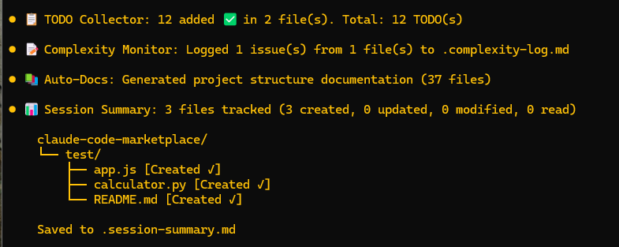
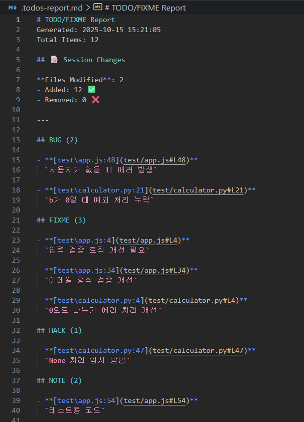
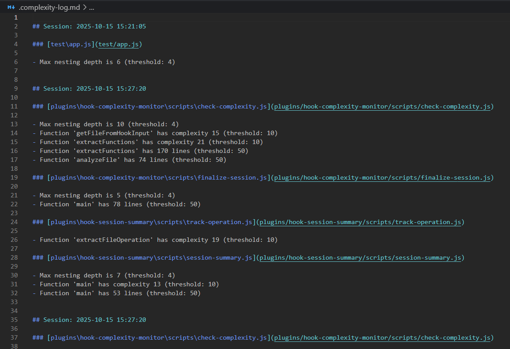
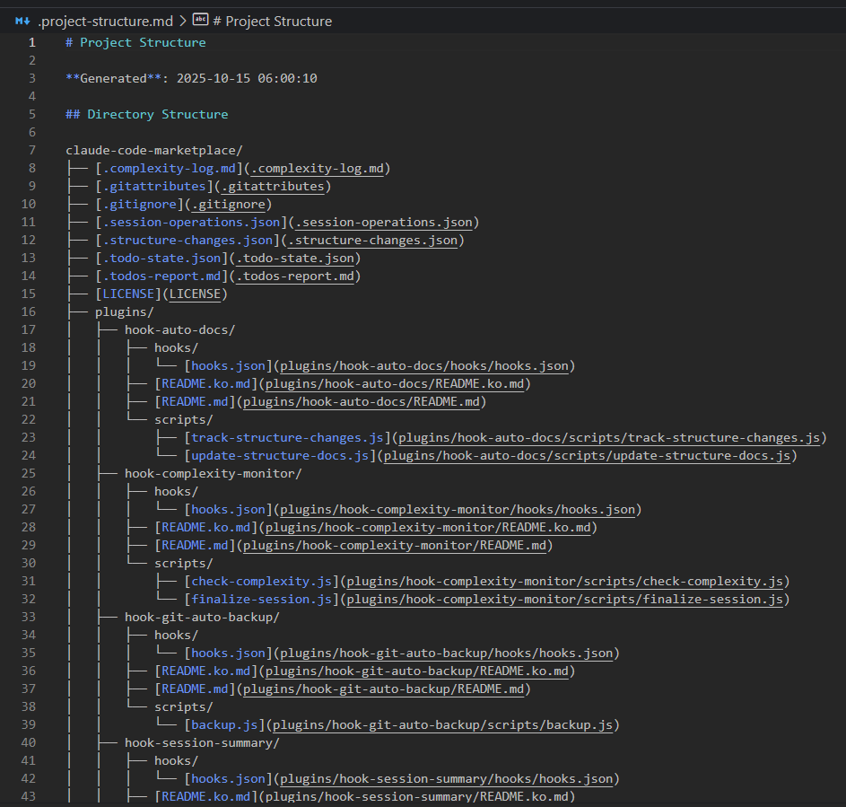
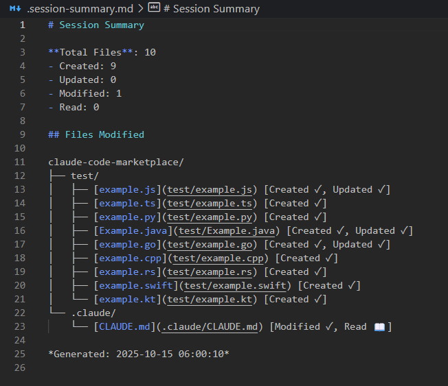

# Claude Code 플러그인

**[Website →](https://dev-gom.github.io/claude-code-marketplace/)**

> **버전**: 2.31.0 | **최종 업데이트**: 2025-12-02
>
> **언어**: [English](README.md) | [한국어](README.ko.md)

> **⚠️ 중요 공지 (>= v2.0.17)**
> 채팅창에 훅 로그가 계속 쌓이는 이슈가 있습니다. 이 문제가 해결될 때까지 hooks.json에서 `suppressOutput: true`를 사용하여 PostToolUse 훅 출력을 숨겼습니다. Stop 훅 메시지는 `.plugin-config/[plugin-name].json`의 `"showLogs": false`(기본값)로 제어됩니다. `true`로 설정하면 활성화됩니다. 자세한 내용은 [설정](#설정)을 참조하세요.

일반적인 개발 워크플로우(Workflow)를 자동화하는 강력한 Claude Code 생산성 플러그인(Plugin) 모음입니다.



## 포함된 플러그인

### 1. 🔄 [Git Auto-Backup](plugins/hook-git-auto-backup/README.ko.md)

<details>
<summary><strong>📖 플러그인 상세</strong> (펼치기)</summary>

Claude Code 세션(Session)이 끝날 때마다 자동으로 git 커밋을 생성하여 작업 손실을 방지합니다.

**요약:** 세션 종료 시 타임스탬프와 함께 모든 변경사항 자동 커밋 | **훅(Hook):** `Stop`

**[전체 문서 보기 →](plugins/hook-git-auto-backup/README.ko.md)**

</details>

---

### 2. 📋 [TODO Collector](plugins/hook-todo-collector/README.ko.md)

<details>
<summary><strong>📖 플러그인 상세</strong> (펼치기)</summary>

프로젝트 전체를 스캔하여 모든 TODO, FIXME, HACK, XXX, NOTE, BUG 코멘트를 상세 리포트(Report)로 수집합니다.

**요약:** 다양한 언어 지원, 마크다운 리포트 생성 | **훅(Hooks):** `PostToolUse` (Write|Edit|NotebookEdit), `Stop`



**[전체 문서 보기 →](plugins/hook-todo-collector/README.ko.md)**

</details>

---

### 3. 📊 [Code Complexity Monitor](plugins/hook-complexity-monitor/README.ko.md)

<details>
<summary><strong>📖 플러그인 상세</strong> (펼치기)</summary>

코드 복잡도 지표를 모니터링하고 임계값을 초과하면 경고합니다.

**요약:** 순환 복잡도, 함수/파일 길이, 중첩 깊이 추적 | **훅(Hook):** `PostToolUse` (Edit|Write)



**[전체 문서 보기 →](plugins/hook-complexity-monitor/README.ko.md)**

</details>

---

### 4. 📝 [Auto Documentation Generator](plugins/hook-auto-docs/README.ko.md)

<details>
<summary><strong>📖 플러그인 상세</strong> (펼치기)</summary>

디렉토리 트리, 스크립트, 의존성을 포함한 프로젝트 구조를 자동으로 스캔하고 문서화합니다.

**요약:** 프로젝트 구조 문서 생성, 파일 변경 추적, package.json 정보 추출 | **훅(Hooks):** `PostToolUse` (Write), `Stop`



**[전체 문서 보기 →](plugins/hook-auto-docs/README.ko.md)**

</details>

---

### 5. 📊 [Session File Tracker](plugins/hook-session-summary/README.ko.md)

<details>
<summary><strong>📖 플러그인 상세</strong> (펼치기)</summary>

세션 동안 모든 파일 작업을 추적하고 디렉토리 트리 시각화가 포함된 요약 리포트를 생성합니다.

**요약:** 작업 유형별 파일 분류 (Created, Modified, Read) | **훅(Hooks):** `PostToolUse` (Write|Edit|Read|NotebookEdit), `Stop`



**[전체 문서 보기 →](plugins/hook-session-summary/README.ko.md)**

</details>

---

### 6. 🤖 [AI 페어 프로그래밍 스위트](plugins/ai-pair-programming/README.ko.md)

<details>
<summary><strong>📖 플러그인 상세</strong> (펼치기)</summary>

슬래시 커맨드(Slash Command), 전문 에이전트(Agent), 지능형 훅이 통합된 완벽한 AI 페어 프로그래밍 경험.

**요약:** 5개 슬래시 커맨드 + 4개 전문 에이전트 + 3개 지능형 훅 | **커맨드:** `/pair`, `/review`, `/suggest`, `/fix`, `/explain` | **에이전트:** `@code-reviewer`, `@bug-hunter`, `@architect`, `@performance-expert`

**[전체 문서 보기 →](plugins/ai-pair-programming/README.ko.md)**

</details>

---

### 7. 📋 [Spec-Kit 통합](plugins/spec-kit/README.ko.md)

<details>
<summary><strong>📖 플러그인 상세</strong> (펼치기)</summary>

명세 주도 개발(SDD, Specification-Driven Development)을 위한 [GitHub Spec-Kit](https://github.com/github/spec-kit) 통합. 코딩 전에 무엇을(WHAT) 어떻게(HOW) 만들지 정의합니다.

**요약:** 구조화된 개발 워크플로우를 위한 10개 슬래시 커맨드 | **커맨드:** `/spec-kit:init`, `/spec-kit:constitution`, `/spec-kit:specify`, `/spec-kit:plan`, `/spec-kit:tasks`, `/spec-kit:implement` | **워크플로우:** 헌법(Constitution) → 명세(Specification) → 계획(Plan) → 작업(Tasks) → 구현(Implementation)

**[전체 문서 보기 →](plugins/spec-kit/README.ko.md)**

</details>

---

### 8. 🎮 [Unity Dev Toolkit](plugins/unity-dev-toolkit/README.ko.md)

<details>
<summary><strong>📖 플러그인 상세</strong> (펼치기)</summary>

지능형 스크립팅 지원, 코드 리팩토링, 성능 최적화, UI Toolkit 지원, 컴파일 에러 해결, 테스트 자동화를 갖춘 종합 Unity 게임 개발 도구.

**요약:** 4개 전문 에이전트 + 7개 Agent Skills + 3개 슬래시 커맨드 + 10개 프로덕션 템플릿 | **커맨드:** `/unity:new-script`, `/unity:optimize-scene`, `/unity:setup-test` | **에이전트:** `@unity-scripter`, `@unity-refactor`, `@unity-performance`, `@unity-architect` | **기능:** UI Toolkit 템플릿 (Editor + Runtime), 자동 코드 검증, 컴파일 에러 감지 및 수정, 테스트 자동화, 씬 최적화

**[전체 문서 보기 →](plugins/unity-dev-toolkit/README.ko.md)**

</details>

---

### 9. 🔧 [Claude Dev Helper](plugins/claude-dev-helper/README.ko.md)

<details>
<summary><strong>📖 플러그인 상세</strong> (펼치기)</summary>

자동 파일 열기, Git diff 리뷰, VS Code Extension과의 향상된 워크플로우 통합을 제공하는 개발 보조 도구.

**요약:** Claude가 파일 생성/수정 시 VSCode에서 자동 열기 | CodeLens로 Git diff 리뷰 | VS Code Extension으로 향상된 워크플로우 | **훅(Hooks):** `SessionStart`, `PostToolUse` | **기능:** 자동 파일 열기, Git 통합, VS Code 통합

**[전체 문서 보기 →](plugins/claude-dev-helper/README.ko.md)**

</details>

---

### 10. 🔔 [사운드 알림](plugins/hook-sound-notifications/README.ko.md)

<details>
<summary><strong>📖 플러그인 상세</strong> (펼치기)</summary>

사운드 및 볼륨 조절 지원을 갖춘 Claude Code 훅 이벤트에 대한 오디오 알림.

**요약:** 9가지 훅 타입에 대한 볼륨 조절 가능한 사운드 알림 | 크로스 플랫폼 지원 (Windows, macOS, Linux) | 중복 실행 방지 | **훅(Hooks):** `SessionStart`, `SessionEnd`, `PreToolUse`, `PostToolUse`, `Notification`, `UserPromptSubmit`, `Stop`, `SubagentStop`, `PreCompact` | **기능:** 전역 및 훅별 볼륨 설정, 커스텀 사운드 파일, MP3/WAV 지원

**[전체 문서 보기 →](plugins/hook-sound-notifications/README.ko.md)**

</details>

---

### 11. 🚀 [Auto Release Manager](plugins/auto-release-manager/README.ko.md)

<details>
<summary><strong>📖 플러그인 상세</strong> (펼치기)</summary>

지능형 감지와 크로스 플랫폼 지원으로 모든 프로젝트 타입의 버전 업데이트 및 릴리즈를 자동화합니다.

**요약:** 범용 프로젝트 타입 감지 (Node.js, Python, Rust, Go, Unity, Unreal 등) | 크로스 플랫폼 버전 관리 | CHANGELOG 자동 생성 | Git 워크플로우 자동화 | **기능:** 시맨틱 버저닝, Unity 이중 파일 동기화, Conventional Commits 파싱, 외부 의존성 제로 (Python 3.11+)

**[전체 문서 보기 →](plugins/auto-release-manager/README.ko.md)**

</details>

---

### 12. 🌐 [Browser Pilot](plugins/browser-pilot/README.ko.md)

<details>
<summary><strong>📖 플러그인 상세</strong> (펼치기)</summary>

Claude Code를 위한 Chrome DevTools Protocol (CDP) 기반 브라우저 자동화, 웹 스크래핑 및 크롤링.

**요약:** Headless 브라우저 자동화, 스크린샷 캡처, PDF 생성, 폼 자동화, 웹 스크래핑 | **스킬:** CLI를 통한 브라우저 자동화 | **기능:** 봇 감지 우회 (`navigator.webdriver = false`), 인간 같은 딜레이를 사용한 멀티 스텝 워크플로우, 탭 관리, JavaScript 실행

**[전체 문서 보기 →](plugins/browser-pilot/README.ko.md)**

</details>

---

### 14. 🎮 [Unity Editor Toolkit](plugins/unity-editor-toolkit/README.md)

<details>
<summary><strong>📖 플러그인 상세</strong> (펼치기)</summary>

**⚠️ 실험 단계 플러그인** - WebSocket을 통한 실시간 Unity Editor 제어, SQLite 데이터베이스 통합, GUID 기반 영속성, 포괄적인 자동화 테스트, 보안 강화 제공.

**요약:** WebSocket 기반 Unity Editor 제어 (자동 할당 포트 9500-9600) | GUID 기반 GameObject 추적 SQLite 데이터베이스 | 멀티 씬 동기화 | Command Pattern 실행취소/재실행 | Unity Test Framework로 66개 자동화 테스트 | **상태:** 🧪 실험 단계 (v0.7.0) | **Unity 호환성:** Unity 6+ (내장 SQLite) | **설정:** Editor Window 기반 (`Tools > Unity Editor Toolkit > Server Window`)에서 자동 시작 및 선택적 데이터베이스 동기화 | **보안:** SQL 인젝션 방어, Path traversal 방어, 트랜잭션 안전성, 강화된 입력 검증 | **기능:** 실시간 에디터 통신, JSON-RPC 2.0 프로토콜, 영구 GameObject 추적, 자동 마이그레이션, 배치 작업 (500개/배치), 스레드 안전 작업 | **API:** GameObject.Find/Create/Destroy/SetActive, Transform.Get/SetPosition/Rotation/Scale, Scene.GetCurrent/GetAll/Load, Console.GetLogs/Clear, Hierarchy.Get, Database.Connect/Sync/Analytics

**[전체 문서 보기 →](plugins/unity-editor-toolkit/README.md)**

</details>

## 설치

### 빠른 시작 (권장)

1. Claude Code에서 마켓플레이스(Marketplace) 추가:
   ```bash
   /plugin marketplace add https://github.com/Dev-GOM/claude-code-marketplace.git
   ```

2. 플러그인 설치:
   ```bash
   /plugin install hook-git-auto-backup@dev-gom-plugins
   ```
   ```bash
   /plugin install hook-todo-collector@dev-gom-plugins
   ```
   ```bash
   /plugin install hook-complexity-monitor@dev-gom-plugins
   ```
   ```bash
   /plugin install hook-auto-docs@dev-gom-plugins
   ```
   ```bash
   /plugin install hook-session-summary@dev-gom-plugins
   ```
   ```bash
   /plugin install ai-pair-programming@dev-gom-plugins
   ```
   ```bash
   /plugin install spec-kit@dev-gom-plugins
   ```
   ```bash
   /plugin install unity-dev-toolkit@dev-gom-plugins
   ```
   ```bash
   /plugin install claude-dev-helper@dev-gom-plugins
   ```
   ```bash
   /plugin install hook-sound-notifications@dev-gom-plugins
   ```
   ```bash
   /plugin install auto-release-manager@dev-gom-plugins
   ```
   ```bash
   /plugin install browser-pilot@dev-gom-plugins
   ```
   ```bash
   /plugin install unity-editor-toolkit@dev-gom-plugins
   ```

3. 플러그인을 로드하기 위해 Claude Code 재시작:
   ```bash
   claude
   # 또는
   claude -r  # 마지막 세션 재개
   # 또는
   claude -c  # 현재 디렉토리에서 계속
   ```

4. 플러그인 설치 확인:
   ```bash
   /plugin
   ```

### 로컬 설치 (개발용)

1. 이 저장소를 클론하고 이동
2. 로컬 마켓플레이스 추가:
   ```bash
   /plugin marketplace add dev-gom-plugins ./path/to/.claude-plugin/marketplace.json
   ```
3. 위와 같이 플러그인 설치

## 사용법

설치 후 플러그인은 자동으로 작동합니다:

- **Git Auto-Backup**: Claude 세션 종료 후 커밋
- **TODO Collector**: 세션 종료 시 TODO 스캔 및 리포트
- **Complexity Monitor**: Edit/Write 작업 후 코드 확인
- **Auto-Docs**: 세션 종료 시 문서 업데이트
- **Session File Tracker**: 세션 종료 시 파일 작업 요약
- **AI 페어 프로그래밍 스위트**: 커맨드, 에이전트, 훅으로 지능형 지원 제공
- **Spec-Kit 통합**: `/spec-kit:*` 커맨드로 명세 주도 개발 워크플로우 안내
- **Unity Dev Toolkit**: `/unity:*` 커맨드 사용, `@unity-*`로 전문 에이전트 호출, Agent Skills를 통한 자동 스크립트 검증
- **Claude Dev Helper**: Git diff 자동 리뷰, 변경사항 스테이징, 피드백 수집; VS Code Extension 통합으로 향상된 기능
- **Auto Release Manager**: Claude에게 "버전 업데이트" 또는 "릴리즈 생성" 요청으로 자동 버전 관리 및 릴리즈 워크플로우

## 설정

### 플러그인별 설정

각 플러그인은 첫 실행 시 `.plugin-config/[plugin-name].json` 설정 파일을 자동으로 생성합니다. 이 파일들은 플러그인 업데이트 시에도 보존됩니다.

**공통 설정:**
- `showLogs`: Stop 훅 로그 표시 여부 (`false`가 기본값으로 채팅 혼잡도 감소)

**예제** - TODO Collector 로그 활성화:

`.plugin-config/hook-todo-collector.json` 파일 생성 또는 편집:
```json
{
  "showLogs": true,
  "outputDirectory": "",
  "supportedExtensions": null,
  "excludeDirs": null,
  "commentTypes": null,
  "outputFormats": null
}
```

상세한 설정 옵션:

- **[Git Auto-Backup 설정 →](plugins/hook-git-auto-backup/README.ko.md#설정)**
- **[TODO Collector 설정 →](plugins/hook-todo-collector/README.ko.md#설정)**
- **[Complexity Monitor 설정 →](plugins/hook-complexity-monitor/README.ko.md#설정)**
- **[Auto-Docs 설정 →](plugins/hook-auto-docs/README.ko.md#설정)**
- **[Session Tracker 설정 →](plugins/hook-session-summary/README.ko.md#설정)**
- **[AI 페어 프로그래밍 설정 →](plugins/ai-pair-programming/README.ko.md#설정)**
- **[Spec-Kit 문서 →](plugins/spec-kit/README.ko.md)**
- **[Claude Dev Helper 문서 →](plugins/claude-dev-helper/README.ko.md)**

### 빠른 예제

**특정 플러그인 비활성화:**
```bash
/plugin uninstall hook-git-auto-backup@dev-gom-plugins
```

**특정 플러그인의 훅 로그 활성화:**
`.plugin-config/[plugin-name].json` 파일을 편집하고 `"showLogs": true`로 설정

**복잡도 임계값 커스터마이즈:**
[Complexity Monitor 설정](plugins/hook-complexity-monitor/README.ko.md#설정) 참조

**커스텀 TODO 패턴 추가:**
[TODO Collector 설정](plugins/hook-todo-collector/README.ko.md#설정) 참조

## 출력 파일

플러그인은 프로젝트 루트에 다음 파일을 생성합니다:

- `.todos-report.md` - 상세한 TODO 리포트
- `.todos.txt` - 간단한 TODO 목록
- `.complexity-log.txt` - 복잡도 이슈 로그
- `.project-structure.md` - 프로젝트 구조 문서
- `.session-summary.md` - 세션 파일 작업 요약
- `.pair-programming-session.md` - AI 페어 프로그래밍 세션 리포트

**플러그인 설정 파일** (프로젝트 루트에 자동 생성):

- `.plugin-config/` - 플러그인별 설정 파일 (플러그인 업데이트 시에도 설정 보존)

**팁:** 출력 파일은 커밋하지 않으려면 `.gitignore`에 추가하세요. `.plugin-config/`의 설정 파일은 팀과 설정을 공유하려면 커밋하세요:

```gitignore
# 플러그인 출력 파일
.todos-report.md
.complexity-log.md
.project-structure.md
.structure-state.json
.structure-changes.json
.session-summary.md
.pair-programming-session.md
.state/

# 선택사항: 플러그인 설정을 제외하려면 주석 해제 (설정을 공유하지 않으려는 경우)
# .plugin-config/
```

## 요구사항

- Claude Code CLI
- Node.js (플러그인 스크립트 실행용)
- Git (git-auto-backup 플러그인용)

## 문제 해결

### 플러그인이 실행되지 않나요?

1. 플러그인 설치 확인:
   ```bash
   /plugin
   ```

2. 설정에서 hooks가 활성화되어 있는지 확인

3. Node.js가 PATH에 있는지 확인:
   ```bash
   node --version
   ```

### Git 커밋이 작동하지 않나요?

1. git 저장소인지 확인:
   ```bash
   git status
   ```

2. git이 구성되어 있는지 확인:
   ```bash
   git config user.name
   git config user.email
   ```

### 복잡도 모니터에서 오탐이 발생하나요?

프로젝트의 필요에 맞게 플러그인 설정 파일에서 임계값을 조정하세요.

## 개발

### 플러그인 개발자를 위한 정보

각 플러그인의 상세한 기술 문서는 해당 README에 있습니다:
- [Git Auto-Backup 기술 세부사항](plugins/hook-git-auto-backup/README.ko.md#기술-세부사항)
- [TODO Collector 기술 세부사항](plugins/hook-todo-collector/README.ko.md#기술-세부사항)
- [Complexity Monitor 기술 세부사항](plugins/hook-complexity-monitor/README.ko.md#기술-세부사항)
- [Auto-Docs 기술 세부사항](plugins/hook-auto-docs/README.ko.md#기술-세부사항)
- [Session Tracker 기술 세부사항](plugins/hook-session-summary/README.ko.md#기술-세부사항)
- [AI 페어 프로그래밍 기술 세부사항](plugins/ai-pair-programming/README.ko.md#동작-원리)
- [Spec-Kit 통합 가이드](plugins/spec-kit/README.ko.md)
- [Claude Dev Helper 기술 세부사항](plugins/claude-dev-helper/README.ko.md#동작-원리)

## 기여

필요에 따라 이러한 플러그인을 자유롭게 커스터마이징하세요:

1. `.claude-plugin` 디렉토리 포크/복사
2. `plugins/[plugin-name]/`에서 플러그인 스크립트 수정
3. hook 동작을 변경하는 경우 `plugin.json` 업데이트
4. `/plugin validate .claude-plugin`로 테스트

## 라이선스

Apache License 2.0 - 자세한 내용은 [LICENSE](LICENSE)와 [NOTICE](NOTICE)를 참조하세요.

## 크레딧

자동화를 통해 개발자 생산성을 향상시키기 위해 Claude Code용으로 제작되었습니다.

---

**즐거운 코딩 되세요!** 🚀

문제나 제안사항이 있으면 GitHub에서 이슈를 열어주세요.
