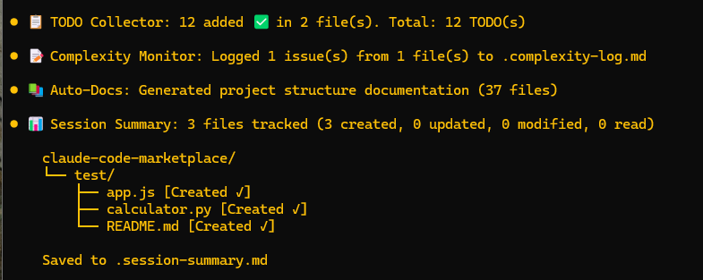

# Claude Code 개발자 유틸리티

> **⚠️ 중요 공지 (v2.0.17)**
> 채팅창에 훅 로그가 계속 쌓이는 이슈가 있습니다. 이 문제가 해결될 때까지 hooks.json에서 `suppressOutput: true`를 사용하여 PostToolUse 훅 출력을 숨겼습니다. Stop 훅 메시지는 `.plugin-config/[plugin-name].json`의 `"showLogs": false`(기본값)로 제어됩니다. `true`로 설정하면 활성화됩니다. 자세한 내용은 [설정](#설정)을 참조하세요.

> **언어**: [English](README.md) | [한국어](README.ko.md)



일반적인 개발 워크플로우를 자동화하는 강력한 Claude Code 생산성 플러그인 모음입니다.

<details>
<summary><strong>📋 변경 이력</strong> (펼치기)</summary>

### Spec-Kit 통합

#### v1.2.0 (2025-10-18)
- ✨ **스마트 사전 체크**: `/spec-kit:plan`, `/spec-kit:tasks`, `/spec-kit:implement` 명령어에서 Open Questions 자동 감지
- 🎨 **통합 커밋 플로우**: 3가지 명확한 옵션이 있는 단일 결정 포인트 (품질 게이트 + 커밋 / 바로 커밋 / 건너뛰기)
- 📋 **더 나은 UX**: 각 커밋 옵션에 대한 상황별 적절한 안내
- 🛡️ **오류 방지**: 진행하기 전에 불명확한 요구사항에 대해 경고
- 📖 **문서화**: README에 포괄적인 "스마트 사전 체크" 섹션 추가

#### v1.1.0 (2025-10-17)
- ✨ **토큰 효율성**: draft 파일을 사용하는 2계층 아키텍처 구현
- 🚀 **성능**: 전체 내용 대신 파일 경로 사용으로 토큰 사용량 감소
- 📁 **Draft 시스템**: 모든 명령어가 `.specify/temp/`에 재사용 가능한 draft 파일 생성
- 📝 **지시사항**: 각 명령어마다 중복 단계를 건너뛰는 정확한 지시사항 추가
- 🌐 **다국어**: 모든 명령어에 대한 시스템 언어 감지 개선

#### v1.0.0 (2025-10-16)
- 🎉 최초 릴리스
- 📋 완전한 SDD 워크플로우를 위한 10개 슬래시 명령어
- 🔧 GitHub Spec-Kit CLI와의 통합

---

### AI 페어 프로그래밍 스위트

#### v1.0.0 (2025-10-15)
- 🎉 최초 릴리스
- 💬 5개 슬래시 커맨드: `/pair`, `/review`, `/suggest`, `/fix`, `/explain`
- 🤖 4개 전문 에이전트: `@code-reviewer`, `@bug-hunter`, `@architect`, `@performance-expert`
- 🔔 3개 지능형 훅: Edit/Write 시 코드 리뷰, 버그 감지, 세션 요약
- 🎨 모든 플러그인을 위한 설정 시스템

---

### TODO Collector

#### v1.0.0 (2025-10-14)
- 🎉 최초 릴리스
- 🔗 TODO 리포트에 클릭 가능한 파일 링크
- 📝 다양한 코멘트 타입 지원 (TODO, FIXME, HACK, XXX, NOTE, BUG)
- 📊 통계가 포함된 상세한 마크다운 리포트
- 🎯 마크다운 헤더 건너뛰기로 오탐 방지
- 🌐 다국어 지원

---

### 훅 플러그인들 (Git Auto-Backup, Complexity Monitor, Auto-Docs, Session Summary)

#### v1.0.0 (2025-10-14)
- 🎉 최초 릴리스
- 🔄 **Git Auto-Backup**: 세션 종료 후 자동 git 커밋
- 📊 **Complexity Monitor**: 설정 가능한 임계값으로 코드 복잡도 추적
- 📝 **Auto-Docs**: 프로젝트 구조 자동 문서화
- 📋 **Session Summary**: 세션 동안 모든 파일 작업 추적
- ⚙️ `.plugin-config/` 파일을 통한 설정 가능
- 🔇 `showLogs` 설정으로 선택적 로그 표시

</details>

## 포함된 플러그인

### 1. 🔄 [Git Auto-Backup](plugins/hook-git-auto-backup/README.ko.md)

Claude Code 세션이 끝날 때마다 자동으로 git 커밋을 생성하여 작업 손실을 방지합니다.

**요약:** 세션 종료 시 타임스탬프와 함께 모든 변경사항 자동 커밋 | **Hook:** `Stop`

**[📖 전체 문서 보기 →](plugins/hook-git-auto-backup/README.ko.md)**

---

### 2. 📋 [TODO Collector](plugins/hook-todo-collector/README.ko.md)

프로젝트 전체를 스캔하여 모든 TODO, FIXME, HACK, XXX, NOTE, BUG 코멘트를 상세 리포트로 수집합니다.

**요약:** 다양한 언어 지원, 마크다운 리포트 생성 | **Hooks:** `PostToolUse` (Write|Edit|NotebookEdit), `Stop`


**[📖 전체 문서 보기 →](plugins/hook-todo-collector/README.ko.md)**

---

### 3. 📊 [Code Complexity Monitor](plugins/hook-complexity-monitor/README.ko.md)

코드 복잡도 지표를 모니터링하고 임계값을 초과하면 경고합니다.

**요약:** 순환 복잡도, 함수/파일 길이, 중첩 깊이 추적 | **Hook:** `PostToolUse` (Edit|Write)


**[📖 전체 문서 보기 →](plugins/hook-complexity-monitor/README.ko.md)**

---

### 4. 📝 [Auto Documentation Generator](plugins/hook-auto-docs/README.ko.md)

디렉토리 트리, 스크립트, 의존성을 포함한 프로젝트 구조를 자동으로 스캔하고 문서화합니다.

**요약:** 프로젝트 구조 문서 생성, 파일 변경 추적, package.json 정보 추출 | **Hooks:** `PostToolUse` (Write), `Stop`


**[📖 전체 문서 보기 →](plugins/hook-auto-docs/README.ko.md)**

---

### 5. 📊 [Session File Tracker](plugins/hook-session-summary/README.ko.md)

세션 동안 모든 파일 작업을 추적하고 디렉토리 트리 시각화가 포함된 요약 리포트를 생성합니다.

**요약:** 작업 유형별 파일 분류 (Created, Modified, Read) | **Hooks:** `PostToolUse` (Write|Edit|Read|NotebookEdit), `Stop`


**[📖 전체 문서 보기 →](plugins/hook-session-summary/README.ko.md)**

---

### 6. 🤖 [AI 페어 프로그래밍 스위트](plugins/ai-pair-programming/README.ko.md)

슬래시 커맨드, 전문 에이전트, 지능형 훅이 통합된 완벽한 AI 페어 프로그래밍 경험.

**요약:** 5개 슬래시 커맨드 + 4개 전문 에이전트 + 3개 지능형 훅 | **커맨드:** `/pair`, `/review`, `/suggest`, `/fix`, `/explain` | **에이전트:** `@code-reviewer`, `@bug-hunter`, `@architect`, `@performance-expert`

**[📖 전체 문서 보기 →](plugins/ai-pair-programming/README.ko.md)**

---

### 7. 📋 [Spec-Kit 통합](plugins/spec-kit/README.ko.md)

명세 주도 개발(SDD)을 위한 [GitHub Spec-Kit](https://github.com/github/spec-kit) 통합. 코딩 전에 무엇을(WHAT) 어떻게(HOW) 만들지 정의합니다.

**요약:** 구조화된 개발 워크플로우를 위한 10개 슬래시 커맨드 | **커맨드:** `/spec-kit:init`, `/spec-kit:constitution`, `/spec-kit:specify`, `/spec-kit:plan`, `/spec-kit:tasks`, `/spec-kit:implement` | **워크플로우:** 헌법 → 명세 → 계획 → 작업 → 구현

**[📖 전체 문서 보기 →](plugins/spec-kit/README.ko.md)**

## 설치

### 빠른 시작 (권장)

1. Claude Code에서 마켓플레이스 추가:
   ```bash
   /plugin marketplace add https://github.com/Dev-GOM/claude-code-marketplace.git
   ```

2. 플러그인 설치:
   ```bash
   /plugin install hook-git-auto-backup@dev-gom-plugins
   /plugin install hook-todo-collector@dev-gom-plugins
   /plugin install hook-complexity-monitor@dev-gom-plugins
   /plugin install hook-auto-docs@dev-gom-plugins
   /plugin install hook-session-summary@dev-gom-plugins
   /plugin install ai-pair-programming@dev-gom-plugins
   /plugin install spec-kit@dev-gom-plugins
   ```

3. 플러그인을 로드하기 위해 Claude Code 재시작:
   ```bash
   claude
   # 또는
   claude -r  # 마지막 세션 재개
   # 또는
   claude -c  # 현재 디렉토리에서 계속
   ```

4. 플러그인 설치 확인:
   ```bash
   /plugin
   ```

### 로컬 설치 (개발용)

1. 이 저장소를 클론하고 이동
2. 로컬 마켓플레이스 추가:
   ```bash
   /plugin marketplace add dev-gom-plugins ./path/to/.claude-plugin/marketplace.json
   ```
3. 위와 같이 플러그인 설치

## 사용법

설치 후 플러그인은 자동으로 작동합니다:

- **Git Auto-Backup**: Claude 세션 종료 후 커밋
- **TODO Collector**: 세션 종료 시 TODO 스캔 및 리포트
- **Complexity Monitor**: Edit/Write 작업 후 코드 확인
- **Auto-Docs**: 세션 종료 시 문서 업데이트
- **Session File Tracker**: 세션 종료 시 파일 작업 요약
- **AI 페어 프로그래밍 스위트**: 커맨드, 에이전트, 훅으로 지능형 지원 제공
- **Spec-Kit 통합**: `/spec-kit:*` 커맨드로 명세 주도 개발 워크플로우 안내

## 설정

### 플러그인별 설정

각 플러그인은 첫 실행 시 `.plugin-config/[plugin-name].json` 설정 파일을 자동으로 생성합니다. 이 파일들은 플러그인 업데이트 시에도 보존됩니다.

**공통 설정:**
- `showLogs`: Stop 훅 로그 표시 여부 (`false`가 기본값으로 채팅 혼잡도 감소)

**예제** - TODO Collector 로그 활성화:

`.plugin-config/hook-todo-collector.json` 파일 생성 또는 편집:
```json
{
  "showLogs": true,
  "outputDirectory": "",
  "supportedExtensions": null,
  "excludeDirs": null,
  "commentTypes": null,
  "outputFormats": null
}
```

상세한 설정 옵션:

- **[Git Auto-Backup 설정 →](plugins/hook-git-auto-backup/README.ko.md#설정)**
- **[TODO Collector 설정 →](plugins/hook-todo-collector/README.ko.md#설정)**
- **[Complexity Monitor 설정 →](plugins/hook-complexity-monitor/README.ko.md#설정)**
- **[Auto-Docs 설정 →](plugins/hook-auto-docs/README.ko.md#설정)**
- **[Session Tracker 설정 →](plugins/hook-session-summary/README.ko.md#설정)**
- **[AI 페어 프로그래밍 설정 →](plugins/ai-pair-programming/README.ko.md#설정)**
- **[Spec-Kit 문서 →](plugins/spec-kit/README.ko.md)**

### 빠른 예제

**특정 플러그인 비활성화:**
```bash
/plugin uninstall hook-git-auto-backup@dev-gom-plugins
```

**특정 플러그인의 훅 로그 활성화:**
`.plugin-config/[plugin-name].json` 파일을 편집하고 `"showLogs": true`로 설정

**복잡도 임계값 커스터마이즈:**
[Complexity Monitor 설정](plugins/hook-complexity-monitor/README.ko.md#설정) 참조

**커스텀 TODO 패턴 추가:**
[TODO Collector 설정](plugins/hook-todo-collector/README.ko.md#설정) 참조

## 출력 파일

플러그인은 프로젝트 루트에 다음 파일을 생성합니다:

- `.todos-report.md` - 상세한 TODO 리포트
- `.todos.txt` - 간단한 TODO 목록
- `.complexity-log.txt` - 복잡도 이슈 로그
- `.project-structure.md` - 프로젝트 구조 문서
- `.session-summary.md` - 세션 파일 작업 요약
- `.pair-programming-session.md` - AI 페어 프로그래밍 세션 리포트

**플러그인 설정 파일** (프로젝트 루트에 자동 생성):

- `.plugin-config/` - 플러그인별 설정 파일 (플러그인 업데이트 시에도 설정 보존)

**팁:** 출력 파일은 커밋하지 않으려면 `.gitignore`에 추가하세요. `.plugin-config/`의 설정 파일은 팀과 설정을 공유하려면 커밋하세요:

```gitignore
# 플러그인 출력 파일
.todos-report.md
.todos.txt
.complexity-log.txt
.project-structure.md
.structure-state.json
.structure-changes.json
.session-summary.md
.pair-programming-session.md
.state/

# 선택사항: 플러그인 설정을 제외하려면 주석 해제 (설정을 공유하지 않으려는 경우)
# .plugin-config/
```

## 요구사항

- Claude Code CLI
- Node.js (플러그인 스크립트 실행용)
- Git (git-auto-backup 플러그인용)

## 문제 해결

### 플러그인이 실행되지 않나요?

1. 플러그인 설치 확인:
   ```bash
   /plugin
   ```

2. 설정에서 hooks가 활성화되어 있는지 확인

3. Node.js가 PATH에 있는지 확인:
   ```bash
   node --version
   ```

### Git 커밋이 작동하지 않나요?

1. git 저장소인지 확인:
   ```bash
   git status
   ```

2. git이 구성되어 있는지 확인:
   ```bash
   git config user.name
   git config user.email
   ```

### 복잡도 모니터에서 오탐이 발생하나요?

프로젝트의 필요에 맞게 플러그인 설정 파일에서 임계값을 조정하세요.

## 개발

### 플러그인 개발자를 위한 정보

각 플러그인의 상세한 기술 문서는 해당 README에 있습니다:
- [Git Auto-Backup 기술 세부사항](plugins/hook-git-auto-backup/README.ko.md#기술-세부사항)
- [TODO Collector 기술 세부사항](plugins/hook-todo-collector/README.ko.md#기술-세부사항)
- [Complexity Monitor 기술 세부사항](plugins/hook-complexity-monitor/README.ko.md#기술-세부사항)
- [Auto-Docs 기술 세부사항](plugins/hook-auto-docs/README.ko.md#기술-세부사항)
- [Session Tracker 기술 세부사항](plugins/hook-session-summary/README.ko.md#기술-세부사항)
- [AI 페어 프로그래밍 기술 세부사항](plugins/ai-pair-programming/README.ko.md#동작-원리)
- [Spec-Kit 통합 가이드](plugins/spec-kit/README.ko.md)

## 기여

필요에 따라 이러한 플러그인을 자유롭게 커스터마이징하세요:

1. `.claude-plugin` 디렉토리 포크/복사
2. `plugins/[plugin-name]/`에서 플러그인 스크립트 수정
3. hook 동작을 변경하는 경우 `plugin.json` 업데이트
4. `/plugin validate .claude-plugin`로 테스트

## 라이선스

MIT 라이선스 - 프로젝트에 자유롭게 사용하고 수정하세요.

## 크레딧

자동화를 통해 개발자 생산성을 향상시키기 위해 Claude Code용으로 제작되었습니다.

---

**즐거운 코딩 되세요!** 🚀

문제나 제안사항이 있으면 GitHub에서 이슈를 열어주세요.
