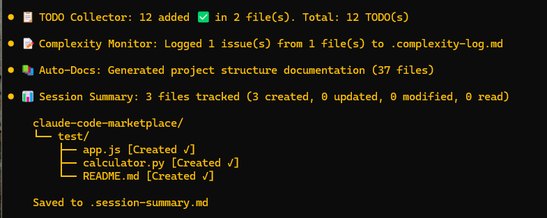
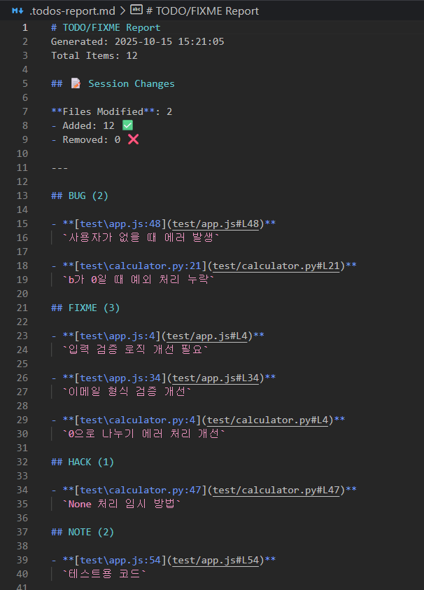
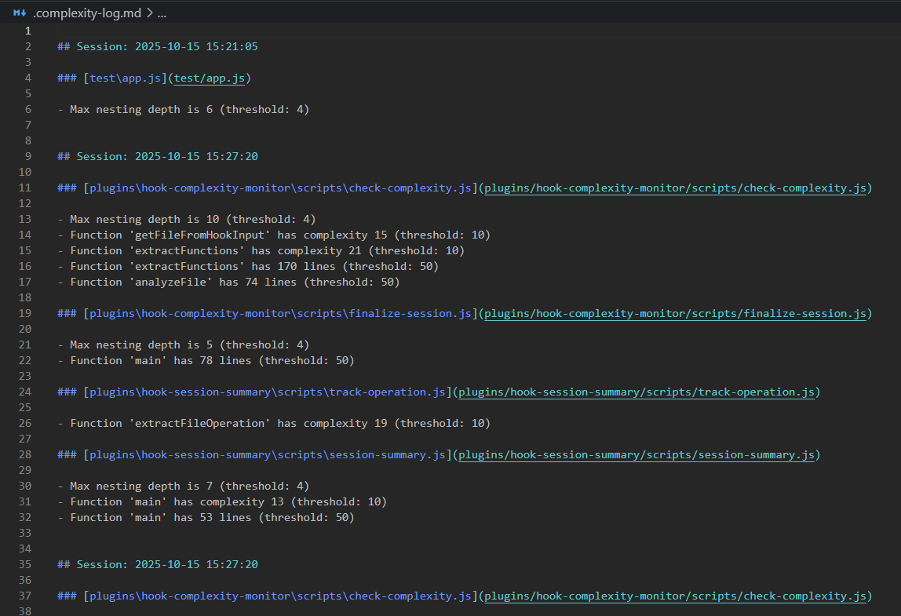
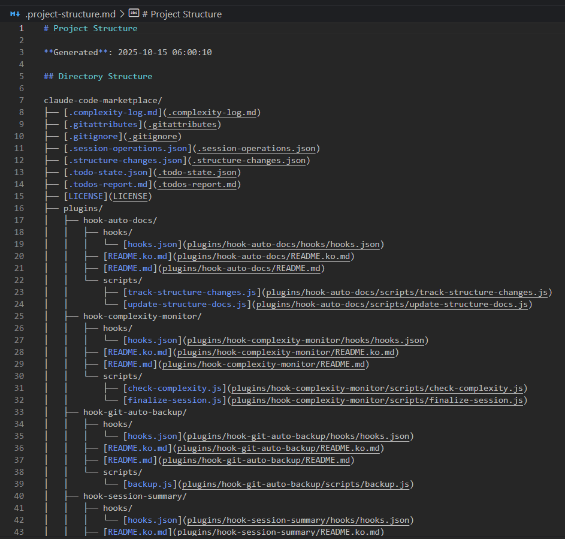
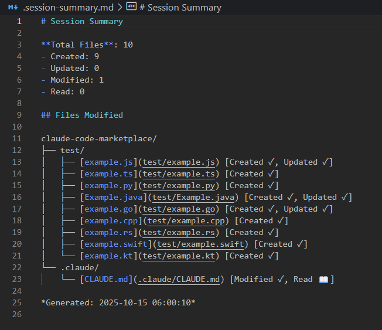

# Claude Code Plugins

> **Version**: 2.3.0 | **Last Updated**: 2025-10-21
>
> **Language**: [English](README.md) | [한국어](README.ko.md)
>
> **📋 Changelog**: [English](CHANGELOG.md) | [한국어](CHANGELOG.ko.md)

> **⚠️ Important Notice (>= v2.0.17)**
> There is a known issue where hook logs stack in the chat window. Until this is resolved, PostToolUse hook outputs are hidden using `suppressOutput: true` in hooks.json. Stop hook messages can be controlled via `.plugin-config/[plugin-name].json` with `"showLogs": false` (default). Set to `true` to enable. See [Configuration](#configuration) for details.

A collection of powerful productivity plugins for Claude Code to automate common development workflows.



## Included Plugins

### 1. 🔄 [Git Auto-Backup](plugins/hook-git-auto-backup/README.md)

<details>
<summary><strong>📖 Plugin Details</strong> (Click to expand)</summary>

Automatically creates git commits after each Claude Code session to prevent work loss.

**Quick Info:** Auto-commits all changes with timestamps when session ends | **Hook:** `Stop`

**[Read Full Documentation →](plugins/hook-git-auto-backup/README.md)**

</details>

---

### 2. 📋 [TODO Collector](plugins/hook-todo-collector/README.md)

<details>
<summary><strong>📖 Plugin Details</strong> (Click to expand)</summary>

Scans your entire project and collects all TODO, FIXME, HACK, XXX, NOTE, and BUG comments into a detailed report.

**Quick Info:** Supports multiple languages, generates markdown report | **Hooks:** `PostToolUse` (Write|Edit|NotebookEdit), `Stop`



**[Read Full Documentation →](plugins/hook-todo-collector/README.md)**

</details>

---

### 3. 📊 [Code Complexity Monitor](plugins/hook-complexity-monitor/README.md)

<details>
<summary><strong>📖 Plugin Details</strong> (Click to expand)</summary>

Monitors code complexity metrics and warns when thresholds are exceeded.

**Quick Info:** Tracks cyclomatic complexity, function/file length, nesting depth | **Hook:** `PostToolUse` (Edit|Write)



**[Read Full Documentation →](plugins/hook-complexity-monitor/README.md)**

</details>

---

### 4. 📝 [Auto Documentation Generator](plugins/hook-auto-docs/README.md)

<details>
<summary><strong>📖 Plugin Details</strong> (Click to expand)</summary>

Automatically scans and documents your project structure with directory tree, scripts, and dependencies.

**Quick Info:** Generates project structure documentation, tracks file changes, extracts package.json info | **Hooks:** `PostToolUse` (Write), `Stop`



**[Read Full Documentation →](plugins/hook-auto-docs/README.md)**

</details>

---

### 5. 📊 [Session File Tracker](plugins/hook-session-summary/README.md)

<details>
<summary><strong>📖 Plugin Details</strong> (Click to expand)</summary>

Tracks all file operations during a session and generates a summary report with directory tree visualization.

**Quick Info:** Classifies files by operation type (Created, Modified, Read) | **Hooks:** `PostToolUse` (Write|Edit|Read|NotebookEdit), `Stop`



**[Read Full Documentation →](plugins/hook-session-summary/README.md)**

</details>

---

### 6. 🤖 [AI Pair Programming Suite](plugins/ai-pair-programming/README.md)

<details>
<summary><strong>📖 Plugin Details</strong> (Click to expand)</summary>

Complete AI pair programming experience with slash commands, expert agents, and intelligent hooks integrated together.

**Quick Info:** 5 slash commands + 4 expert agents + 3 intelligent hooks | **Commands:** `/pair`, `/review`, `/suggest`, `/fix`, `/explain` | **Agents:** `@code-reviewer`, `@bug-hunter`, `@architect`, `@performance-expert`

**[Read Full Documentation →](plugins/ai-pair-programming/README.md)**

</details>

---

### 7. 📋 [Spec-Kit Integration](plugins/spec-kit/README.md)

<details>
<summary><strong>📖 Plugin Details</strong> (Click to expand)</summary>

[GitHub Spec-Kit](https://github.com/github/spec-kit) integration for Specification-Driven Development (SDD). Define WHAT and HOW before coding.

**Quick Info:** 10 slash commands for structured development workflow | **Commands:** `/spec-kit:init`, `/spec-kit:constitution`, `/spec-kit:specify`, `/spec-kit:plan`, `/spec-kit:tasks`, `/spec-kit:implement` | **Workflow:** Constitution → Specification → Plan → Tasks → Implementation

**[Read Full Documentation →](plugins/spec-kit/README.md)**

</details>

---

### 8. 🎮 [Unity Dev Toolkit](plugins/unity-dev-toolkit/README.md)

<details>
<summary><strong>📖 Plugin Details</strong> (Click to expand)</summary>

Comprehensive Unity game development toolkit with intelligent scripting assistance, code refactoring, performance optimization, and UI Toolkit support.

**Quick Info:** 4 expert agents + 5 Agent Skills + 3 slash commands + 10 production templates | **Commands:** `/unity:new-script`, `/unity:optimize-scene`, `/unity:setup-test` | **Agents:** `@unity-scripter`, `@unity-refactor`, `@unity-performance`, `@unity-architect` | **Features:** UI Toolkit templates (Editor + Runtime), automated code validation, scene optimization

**[Read Full Documentation →](plugins/unity-dev-toolkit/README.md)**

</details>

## Installation

### Quick Start (Recommended)

1. Add the marketplace in Claude Code:
   ```bash
   /plugin marketplace add https://github.com/Dev-GOM/claude-code-marketplace.git
   ```

2. Install plugins:
   ```bash
   /plugin install hook-git-auto-backup@dev-gom-plugins
   ```
   ```bash
   /plugin install hook-todo-collector@dev-gom-plugins
   ```
   ```bash
   /plugin install hook-complexity-monitor@dev-gom-plugins
   ```
   ```bash
   /plugin install hook-auto-docs@dev-gom-plugins
   ```
   ```bash
   /plugin install hook-session-summary@dev-gom-plugins
   ```
   ```bash
   /plugin install ai-pair-programming@dev-gom-plugins
   ```
   ```bash
   /plugin install spec-kit@dev-gom-plugins
   ```
   ```bash
   /plugin install unity-dev-toolkit@dev-gom-plugins
   ```

3. Restart Claude Code to load the plugins:
   ```bash
   claude
   # or
   claude -r  # Resume last session
   # or
   claude -c  # Continue in current directory
   ```

4. Check plugin installation:
   ```bash
   /plugin
   ```

### Local Installation (For Development)

1. Clone this repository and navigate to it
2. Add the local marketplace:
   ```bash
   /plugin marketplace add dev-gom-plugins ./path/to/.claude-plugin/marketplace.json
   ```
3. Install plugins as shown above

## Usage

Once installed, the plugins work automatically:

- **Git Auto-Backup**: Commits after each Claude session ends
- **TODO Collector**: Scans and reports TODOs when session ends
- **Complexity Monitor**: Checks code after Edit/Write operations
- **Auto-Docs**: Updates documentation when session ends
- **Session File Tracker**: Summarizes file operations when session ends
- **AI Pair Programming Suite**: Provides intelligent assistance with commands, agents, and hooks
- **Spec-Kit Integration**: Use `/spec-kit:*` commands to guide specification-driven development workflow
- **Unity Dev Toolkit**: Use `/unity:*` commands, invoke expert agents with `@unity-*`, and get automatic script validation through Agent Skills

## Configuration

### Plugin-Specific Settings

Each plugin automatically creates a configuration file in `.plugin-config/[plugin-name].json` when first run. These files are preserved across plugin updates.

**Common settings:**
- `showLogs`: Control Stop hook log visibility (`false` by default to reduce chat clutter)

**Example** - Enable logs for TODO Collector:

Create or edit `.plugin-config/hook-todo-collector.json`:
```json
{
  "showLogs": true,
  "outputDirectory": "",
  "supportedExtensions": null,
  "excludeDirs": null,
  "commentTypes": null,
  "outputFormats": null
}
```

For detailed configuration options:

- **[Git Auto-Backup Configuration →](plugins/hook-git-auto-backup/README.md#configuration)**
- **[TODO Collector Configuration →](plugins/hook-todo-collector/README.md#configuration)**
- **[Complexity Monitor Configuration →](plugins/hook-complexity-monitor/README.md#configuration)**
- **[Auto-Docs Configuration →](plugins/hook-auto-docs/README.md#configuration)**
- **[Session Tracker Configuration →](plugins/hook-session-summary/README.md#configuration)**
- **[AI Pair Programming Configuration →](plugins/ai-pair-programming/README.md#configuration)**
- **[Spec-Kit Documentation →](plugins/spec-kit/README.md)**

### Quick Examples

**Disable a specific plugin:**
```bash
/plugin uninstall hook-git-auto-backup@dev-gom-plugins
```

**Enable hook logs for a specific plugin:**
Edit `.plugin-config/[plugin-name].json` and set `"showLogs": true`

**Customize complexity thresholds:**
See [Complexity Monitor Configuration](plugins/hook-complexity-monitor/README.md#configuration)

**Add custom TODO patterns:**
See [TODO Collector Configuration](plugins/hook-todo-collector/README.md#configuration)

## Output Files

The plugins generate the following files in your project root:

- `.todos-report.md` - Detailed TODO report
- `.todos.txt` - Simple TODO list
- `.complexity-log.txt` - Complexity issues log
- `.project-structure.md` - Project structure documentation
- `.session-summary.md` - Session file operations summary
- `.pair-programming-session.md` - AI pair programming session report

**Plugin configuration files** (auto-generated in project root):

- `.plugin-config/` - Plugin-specific configuration files (preserves settings across plugin updates)

**Tip:** Add output files to `.gitignore` if you don't want to commit them. Configuration files in `.plugin-config/` should be committed to share settings with your team:

```gitignore
# Plugin output files
.todos-report.md
.complexity-log.md
.project-structure.md
.structure-state.json
.structure-changes.json
.session-summary.md
.pair-programming-session.md
.state/

# Optional: Uncomment to exclude plugin configs (if you don't want to share settings)
# .plugin-config/
```

## Requirements

- Claude Code CLI
- Node.js (for running plugin scripts)
- Git (for git-auto-backup plugin)

## Troubleshooting

### Plugins not running?

1. Check plugin installation:
   ```bash
   /plugin
   ```

2. Verify hooks are enabled in settings

3. Check Node.js is in PATH:
   ```bash
   node --version
   ```

### Git commits not working?

1. Ensure you're in a git repository:
   ```bash
   git status
   ```

2. Check git is configured:
   ```bash
   git config user.name
   git config user.email
   ```

### Complexity monitor showing false positives?

Adjust thresholds in the plugin configuration file to match your project's needs.

## Development

### For Plugin Developers

Each plugin has detailed technical documentation in its README:
- [Git Auto-Backup Technical Details](plugins/hook-git-auto-backup/README.md#technical-details)
- [TODO Collector Technical Details](plugins/hook-todo-collector/README.md#technical-details)
- [Complexity Monitor Technical Details](plugins/hook-complexity-monitor/README.md#technical-details)
- [Auto-Docs Technical Details](plugins/hook-auto-docs/README.md#technical-details)
- [Session Tracker Technical Details](plugins/hook-session-summary/README.md#technical-details)
- [AI Pair Programming Technical Details](plugins/ai-pair-programming/README.md#how-it-works)
- [Spec-Kit Integration Guide](plugins/spec-kit/README.md)

## Contributing

Feel free to customize these plugins for your needs:

1. Fork/copy the `.claude-plugin` directory
2. Modify plugin scripts in `plugins/[plugin-name]/`
3. Update `plugin.json` if changing hook behavior
4. Test with `/plugin validate .claude-plugin`

## License

MIT License - feel free to use and modify for your projects.

## Credits

Created for Claude Code to enhance developer productivity through automation.

---

**Happy Coding!** 🚀

For issues or suggestions, please open an issue on GitHub.
