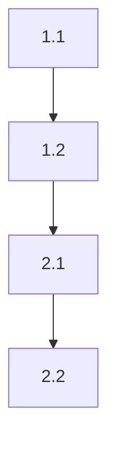

# Break Down Plan into Tasks

**🌐 언어 지시사항**: 이 명령어를 실행할 때는 **사용자의 시스템 언어를 자동으로 감지**하여 해당 언어로 모든 안내, 질문, 작업 분해 가이드, 출력을 제공해야 합니다. 시스템 환경 변수(LANG, LC_ALL 등)나 사용자의 이전 대화 패턴을 분석하여 언어를 판단하세요.

기술 계획을 작고 실행 가능한 작업으로 분해하여 단계별 구현 가이드를 만듭니다.

## Prerequisites

계획이 먼저 존재해야 합니다:

```bash
cat .specify/memory/plan.md
```

없다면 `/spec-kit:plan`을 먼저 실행하세요.

## Step 1: Review Plan

계획의 구현 전략(Implementation Strategy)을 집중적으로 검토:
- 각 단계(Phase)의 작업들
- 완료 기준
- 의존성

## Step 2: Identify Tasks

각 Phase를 개별 작업으로 분해. 좋은 작업의 특징:
- **작음**: 1-4시간 내 완료 가능
- **명확함**: 무엇을 할지 정확히 알 수 있음
- **테스트 가능**: 완료 여부를 검증 가능
- **독립적**: 또는 명확한 의존성

## Step 3: Structure Task List

사용자와 함께 다음 구조로 작업 목록을 정리합니다:

### Tasks Template

```markdown
# Implementation Tasks: [Feature Name]

## Phase 1: [Phase Name]

### Task 1.1: [작업명]

**Description**: [작업 설명]

**Acceptance**:
- [ ] [기준 1]
- [ ] [기준 2]

**Depends on**: None

**Estimate**: 2h

---

### Task 1.2: [작업명]

**Description**: [작업 설명]

**Acceptance**:
- [ ] [기준]

**Depends on**: Task 1.1

**Estimate**: 3h

---

## Phase 2: [Phase Name]

[2단계 작업들...]

## Task Dependencies



## Progress Tracking

- [ ] Phase 1 (0/3 tasks)
  - [ ] Task 1.1
  - [ ] Task 1.2
  - [ ] Task 1.3
- [ ] Phase 2 (0/2 tasks)
  - [ ] Task 2.1
  - [ ] Task 2.2

---
**Created**: [Date]
**Last Updated**: [Date]
```

## Step 4: Prioritize

작업 우선순위 지정:
1. **Critical Path**: 차단 작업 먼저
2. **Dependencies**: 의존성 순서대로
3. **Value**: 높은 가치 작업 우선
4. **Risk**: 높은 리스크 작업 조기 해결

## Step 5: Estimate

각 작업에 예상 시간 할당:
- Small: 1-2 hours
- Medium: 2-4 hours
- Large: 4-8 hours (더 크면 분해 필요)

## Step 6: Save Draft and Execute Spec-Kit Command

### 6.1 수집된 정보를 Draft 파일로 저장

먼저 `.specify/temp/` 디렉토리가 있는지 확인하고 없으면 생성:

```bash
mkdir -p .specify/temp
```

Write 도구를 사용하여 수집된 정보를 `.specify/temp/tasks-draft.md` 파일로 저장합니다:

```markdown
# Tasks Draft

## Phase 1: [Phase Name]

### Task 1.1: [작업명]
- Description: [Step 2-3에서 작성한 작업 설명]
- Acceptance:
  - [완료 기준 1]
  - [완료 기준 2]
- Depends on: None
- Estimate: 2h

### Task 1.2: [작업명]
[Step 2-3에서 작성한 작업 내용...]

## Phase 2: [Phase Name]
[Step 2-3에서 작성한 2단계 작업들...]

## Task Dependencies
[Step 4에서 정리한 의존성 관계...]

## Task Priorities
[Step 4에서 정한 우선순위...]

## Time Estimates
[Step 5에서 할당한 예상 시간들...]
```

### 6.2 Spec-Kit 명령 실행

Draft 파일 경로를 전달하여 SlashCommand 도구로 `/speckit.tasks` 명령을 실행합니다:

```
/speckit.tasks .specify/temp/tasks-draft.md

INSTRUCTION: Read the draft file at the path above using the Read tool. This draft contains ALL the tasks broken down by phase with descriptions, acceptance criteria, dependencies, and estimates. You MUST skip all information collection and breakdown steps and proceed directly to writing the tasks file. Use ONLY the information from the draft file. Do NOT ask the user for any additional information. Process all content in the user's system language.
```

spec-kit 명령어는 draft 파일을 읽어서 `.specify/memory/tasks.md` 파일을 생성/업데이트합니다.

**토큰 절약 효과:**
- 긴 텍스트를 명령어 인자로 전달하지 않음
- 파일 경로만 전달하여 효율적
- Draft 파일로 디버깅 및 재사용 가능

## Next Steps

작업 목록 생성 후:
1. `.specify/memory/tasks.md` 파일 검토
2. `/spec-kit:implement` - 작업 실행 시작
3. `/spec-kit:analyze` - 진행 상황 분석

---

**참고**:
- 작업 분해로 모호한 계획이 명확한 실행 단계가 됩니다
- 우리 플러그인(/spec-kit:tasks)은 정보 수집 역할
- 실제 파일 생성은 spec-kit 명령어(/speckit.tasks)가 담당
