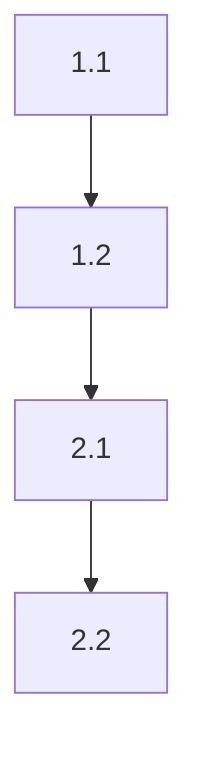

# Break Down Plan into Tasks

## User Input

```text
$ARGUMENTS
```

You **MUST** consider the user input before proceeding (if not empty).

⚠️ **커맨드 구분**: 이것은 **플러그인 커맨드** (/spec-kit:tasks)입니다. 정보 수집과 사용자 논의를 담당합니다. 실제 파일 생성/업데이트는 GitHub Spec-Kit CLI 커맨드 (/speckit.tasks)가 수행합니다.

**🌐 언어 지시사항**: 이 명령어를 실행할 때는 **사용자의 시스템 언어를 자동으로 감지**하여 해당 언어로 모든 안내, 질문, 작업 분해 가이드, 출력을 제공해야 합니다. 시스템 환경 변수(LANG, LC_ALL 등)나 사용자의 이전 대화 패턴을 분석하여 언어를 판단하세요.

기술 계획을 작고 실행 가능한 작업으로 분해하여 단계별 구현 가이드를 만듭니다.

## Prerequisites

계획이 먼저 존재해야 합니다:

```bash
# 현재 브랜치 확인
CURRENT_BRANCH=$(git branch --show-current)

# 계획 파일 확인
cat "specs/$CURRENT_BRANCH/plan.md"
```

없다면 `/spec-kit:plan`을 먼저 실행하세요.

## Step 1: Git 변경사항 확인

작업 분해 전에 현재 작업 디렉토리의 변경사항과 브랜치 퍼블리쉬 상태를 확인합니다:

```bash
# 변경사항 확인
git status --short

# Upstream 브랜치 확인 (퍼블리쉬 여부)
git rev-parse --abbrev-ref @{upstream} 2>/dev/null
```

### 시나리오 A: 변경사항이 없는 경우

즉시 Step 2로 이동

### 시나리오 B: 변경사항 있음 + Upstream 브랜치 없음 (미퍼블리쉬)

브랜치가 아직 원격에 퍼블리쉬되지 않은 상태에서 변경사항이 있는 경우:

AskUserQuestion 도구를 사용하여 사용자에게 확인:

```json
{
  "questions": [{
    "question": "현재 작업 디렉토리에 변경되지 않은 파일이 있고, 브랜치가 아직 퍼블리쉬되지 않았습니다. 어떻게 처리하시겠습니까?",
    "header": "Git 변경사항",
    "multiSelect": false,
    "options": [
      {
        "label": "퍼블리쉬 + 커밋",
        "description": "현재 변경사항을 커밋하고 브랜치를 원격 저장소에 퍼블리쉬합니다. 팀과 공유하거나 백업이 필요한 경우 권장합니다."
      },
      {
        "label": "로컬에만 커밋",
        "description": "현재 변경사항을 커밋하지만 브랜치는 로컬에만 유지합니다. 아직 공유할 준비가 안 된 경우에 사용합니다."
      },
      {
        "label": "나중에 결정",
        "description": "작업 분해를 진행하고 나중에 모든 변경사항을 함께 처리합니다."
      }
    ]
  }]
}
```

**사용자 선택에 따라 진행:**
- **"퍼블리쉬 + 커밋"** 선택 시:
  1. 사용자에게 커밋 메시지 요청
  2. `git add -A && git commit -m "[메시지]"`
  3. `git push -u origin [브랜치명]`
  4. Step 2로 이동
- **"로컬에만 커밋"** 선택 시:
  1. 사용자에게 커밋 메시지 요청
  2. `git add -A && git commit -m "[메시지]"`
  3. Step 2로 이동
- **"나중에 결정"** 선택 시: 즉시 Step 2로 이동

### 시나리오 C: 변경사항 있음 + Upstream 브랜치 있음 (이미 퍼블리쉬됨)

브랜치가 이미 원격에 퍼블리쉬된 상태에서 변경사항이 있는 경우:

AskUserQuestion 도구를 사용하여 사용자에게 확인:

```json
{
  "questions": [{
    "question": "현재 작업 디렉토리에 변경되지 않은 파일이 있습니다. 먼저 커밋하시겠습니까?",
    "header": "Git 변경사항",
    "multiSelect": false,
    "options": [
      {
        "label": "커밋하기",
        "description": "현재 변경사항을 커밋하고 원격 브랜치에 푸쉬합니다. 작업을 명확하게 분리할 수 있습니다."
      },
      {
        "label": "나중에 결정",
        "description": "작업 분해를 진행하고 나중에 모든 변경사항을 함께 커밋합니다."
      }
    ]
  }]
}
```

**사용자 선택에 따라 진행:**
- **"커밋하기"** 선택 시:
  1. 사용자에게 커밋 메시지 요청
  2. `git add -A && git commit -m "[메시지]"`
  3. `git push`
  4. Step 2로 이동
- **"나중에 결정"** 선택 시: 즉시 Step 2로 이동

---

## Step 2: Check Existing File and Choose Update Mode

기존 작업 목록 파일 확인:

```bash
# 작업 목록 파일 확인
cat "specs/$CURRENT_BRANCH/tasks.md"
```

### If File Exists - Choose Update Mode

AskUserQuestion 도구를 사용하여 사용자에게 확인:

```json
{
  "questions": [{
    "question": "기존 작업 목록 파일이 존재합니다. 어떻게 업데이트하시겠습니까?",
    "header": "업데이트 모드",
    "multiSelect": false,
    "options": [
      {
        "label": "완전 재생성 (Full Regeneration)",
        "description": "처음부터 모든 정보를 다시 수집하여 새로 작성합니다. 계획이 크게 변경되어 작업 구조가 완전히 바뀌었을 때 추천합니다."
      },
      {
        "label": "부분 업데이트 (Incremental Update)",
        "description": "기존 작업 목록을 유지하고 변경/추가할 부분만 질문합니다. 특정 Phase에 새 작업 추가, 일부 작업의 수용 기준 변경 등 일부 내용만 업데이트할 때 추천합니다."
      }
    ]
  }]
}
```

**사용자 선택에 따라 진행:**
- **"완전 재생성"** 선택 시 → Step 3부터 정상 진행 (완전 재작성)
- **"부분 업데이트"** 선택 시 → 기존 작업 목록 표시 + "어떤 부분을 업데이트하시겠습니까?" 질문 + 변경사항만 수집 후 merge

### If File Not Exists

Step 3부터 정상 진행 (처음 작성)

---

## Step 3: Review Plan and Check Prerequisites

계획의 구현 전략(Implementation Strategy)을 집중적으로 검토:
- 각 단계(Phase)의 작업들
- 완료 기준
- 의존성

**⚠️ 사전 체크:**

작업 분해 전에 명세와 계획의 완성도를 확인하세요:

```bash
# specification.md와 plan.md에서 Open Questions 체크
cat "specs/$CURRENT_BRANCH/spec.md" | grep -A 10 "Open Questions"
cat "specs/$CURRENT_BRANCH/plan.md" | grep -A 10 "Open Technical Questions"
```

**만약 Open Questions가 있다면:**

```
⚠️ **경고**: 명세나 계획에 미해결 질문이 있습니다!

작업을 분해하기 전에 `/spec-kit:clarify`를 실행하여 모호한 부분을 명확히 하는 것을 강력히 권장합니다.

명확하지 않은 요구사항으로 작업을 분해하면:
- 불완전한 작업 정의
- 잘못된 의존성 파악
- 구현 중 방향 전환 필요
- 시간 낭비

그래도 계속 진행하시겠습니까? (예/아니오)
```

사용자가 "아니오"를 선택하면 `/spec-kit:clarify`를 먼저 실행하도록 안내하세요.

## Step 4: Identify Tasks

각 Phase를 개별 작업으로 분해. 좋은 작업의 특징:
- **작음**: 1-4시간 내 완료 가능
- **명확함**: 무엇을 할지 정확히 알 수 있음
- **테스트 가능**: 완료 여부를 검증 가능
- **독립적**: 또는 명확한 의존성

## Step 5: Structure Task List

사용자와 함께 다음 구조로 작업 목록을 정리합니다:

### Tasks Template

```markdown
# Implementation Tasks: [Feature Name]

## Phase 1: [Phase Name]

### Task 1.1: [작업명]

**Description**: [작업 설명]

**Acceptance**:
- [ ] [기준 1]
- [ ] [기준 2]

**Depends on**: None

**Estimate**: 2h

---

### Task 1.2: [작업명]

**Description**: [작업 설명]

**Acceptance**:
- [ ] [기준]

**Depends on**: Task 1.1

**Estimate**: 3h

---

## Phase 2: [Phase Name]

[2단계 작업들...]

## Task Dependencies



## Progress Tracking

- [ ] Phase 1 (0/3 tasks)
  - [ ] Task 1.1
  - [ ] Task 1.2
  - [ ] Task 1.3
- [ ] Phase 2 (0/2 tasks)
  - [ ] Task 2.1
  - [ ] Task 2.2

---
**Created**: [Date]
**Last Updated**: [Date]
```

## Step 6: Prioritize

작업 우선순위 지정:
1. **Critical Path**: 차단 작업 먼저
2. **Dependencies**: 의존성 순서대로
3. **Value**: 높은 가치 작업 우선
4. **Risk**: 높은 리스크 작업 조기 해결

## Step 7: Estimate

각 작업에 예상 시간 할당:
- Small: 1-2 hours
- Medium: 2-4 hours
- Large: 4-8 hours (더 크면 분해 필요)

## Step 8: Save Draft and Execute Spec-Kit Command

### 8.1 수집된 정보를 Draft 파일로 저장

먼저 현재 기능의 drafts 디렉토리 생성:

```bash
# drafts 디렉토리 생성
mkdir -p "specs/$CURRENT_BRANCH/drafts"
```

Write 도구를 사용하여 수집된 정보를 `specs/$CURRENT_BRANCH/drafts/tasks-draft.md` 파일로 저장합니다:

```markdown
# Tasks Draft

## Phase 1: [Phase Name]

### Task 1.1: [작업명]
- Description: [Step 4-5에서 작성한 작업 설명]
- Acceptance:
  - [완료 기준 1]
  - [완료 기준 2]
- Depends on: None
- Estimate: 2h

### Task 1.2: [작업명]
[Step 4-5에서 작성한 작업 내용...]

## Phase 2: [Phase Name]
[Step 4-5에서 작성한 2단계 작업들...]

## Task Dependencies
[Step 6에서 정리한 의존성 관계...]

## Task Priorities
[Step 6에서 정한 우선순위...]

## Time Estimates
[Step 7에서 할당한 예상 시간들...]
```

### 8.2 Spec-Kit 명령 실행

Draft 파일 경로와 **브랜치 정보**를 전달하여 SlashCommand 도구로 `/speckit.tasks` 명령을 실행합니다:

```
/speckit.tasks INSTRUCTION: This command is being called from /spec-kit:tasks plugin. Current branch is "$CURRENT_BRANCH" and draft at "specs/$CURRENT_BRANCH/drafts/tasks-draft.md". Read draft. Draft contains ALL tasks broken down by phase with descriptions, acceptance criteria, dependencies, and estimates. Skip information collection and breakdown steps (Step 3-7) and proceed directly to writing tasks file. **CRITICAL - MUST FOLLOW:** 1. LANGUAGE: Process ALL content in user's system language. 2. ASKUSERQUESTION: Use AskUserQuestion tool if clarification needed. 3. FILE WRITE: Write to "specs/$CURRENT_BRANCH/tasks.md" with complete task breakdown structure.
```

spec-kit 명령어는 draft 파일을 읽어서 `specs/$CURRENT_BRANCH/tasks.md` 파일을 생성/업데이트합니다.

**토큰 절약 효과:**
- 긴 텍스트를 명령어 인자로 전달하지 않음
- 파일 경로만 전달하여 효율적
- Draft 파일로 디버깅 및 재사용 가능

## Next Steps

작업 목록 생성 후:
1. `specs/$CURRENT_BRANCH/tasks.md` 파일 검토
2. `/spec-kit:implement` - 작업 실행 시작
3. `/spec-kit:analyze` - 진행 상황 분석

## What's Next?

AskUserQuestion 도구를 사용하여 사용자에게 다음 작업을 물어봅니다:

```json
{
  "questions": [{
    "question": "작업 분해가 완료되었습니다. 다음 단계로 무엇을 진행하시겠습니까?",
    "header": "다음 단계",
    "multiSelect": false,
    "options": [
      {
        "label": "구현 시작 (/spec-kit:implement)",
        "description": "작업 목록에 따라 실제 구현을 시작합니다. (권장 다음 단계)"
      },
      {
        "label": "작업 목록 분석 (/spec-kit:analyze)",
        "description": "구현 전에 작업 목록을 먼저 분석하고 검증합니다."
      },
      {
        "label": "작업 목록 파일 검토",
        "description": "생성된 specs/[브랜치]/tasks.md 파일을 먼저 검토하고 싶습니다."
      },
      {
        "label": "다른 명령어 실행",
        "description": "위 선택지에 없는 다른 spec-kit 명령어를 직접 입력하여 실행합니다."
      },
      {
        "label": "작업 완료",
        "description": "지금은 여기까지만 작업하겠습니다."
      }
    ]
  }]
}
```

**사용자 선택에 따라:**
- **구현 시작** 선택 시 → `/spec-kit:implement` 명령 실행 안내
- **작업 목록 분석** 선택 시 → `/spec-kit:analyze` 명령 실행 안내
- **작업 목록 파일 검토** 선택 시 → `cat "specs/$CURRENT_BRANCH/tasks.md"` 실행 후 다시 선택지 제공
- **다른 명령어 실행** 선택 시 → 사용자가 원하는 명령어 입력 요청
- **작업 완료** 선택 시 → 세션 종료

---

**참고**:
- 작업 분해로 모호한 계획이 명확한 실행 단계가 됩니다
- 우리 플러그인(/spec-kit:tasks)은 정보 수집 역할
- 실제 파일 생성은 spec-kit 명령어(/speckit.tasks)가 담당
